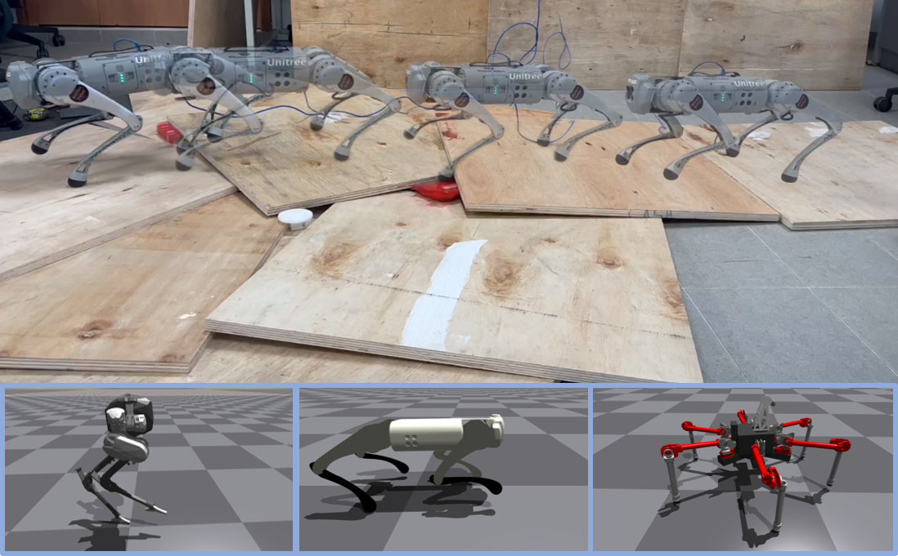
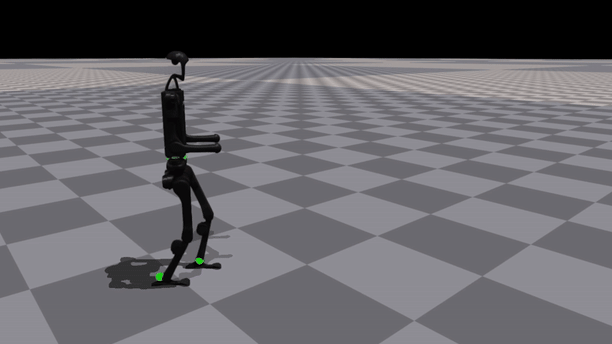

<h1 align="center"> DecAP : Decaying Action Priors for Accelerated Imitation Learning of
Torque-Based Legged Locomotion Policies </h1>

<div align="center">

[[Video]](https://www.youtube.com/watch?v=O1lcry7sHNQ)
[[Paper]](https://arxiv.org/abs/2310.05714)


[](https://developer.nvidia.com/isaac-gym) [](https://ubuntu.com/blog/tag/22-04-lts) []()




</div>

<!-- **Affiliation**: MARMoT Lab, NUS  
**Contact**: shivamsood2000@gmail.com -->

---

## Training in Simulation

## 🛠️ Installation

Follow these steps to set up the [legged_gym](https://github.com/leggedrobotics/legged_gym) environment with DecAP:

---

### 1. Create a Python Virtual Environment

We recommend using **Python 3.8**:

```bash
conda create --name=decap python=3.8
conda activate decap
```

---

### 2. Install PyTorch

#### For CUDA 11.3 (PyTorch 1.10):

```bash
pip install torch==1.10.0+cu113 torchvision==0.11.1+cu113 torchaudio==0.10.0+cu113 \
	 -f https://download.pytorch.org/whl/cu113/torch_stable.html
```

#### For CUDA 12 (PyTorch 2.2):

```bash
pip uninstall torch -y
pip install torch==2.2.2+cu121 torchvision torchaudio \
	 --index-url https://download.pytorch.org/whl/cu121
```

---

### 3. Install Isaac Gym

- Download **Isaac Gym Preview 3** (Preview 2 will not work!) from [NVIDIA Isaac Gym](https://developer.nvidia.com/isaac-gym).
- Install Isaac Gym:

```bash
cd isaacgym/python
pip install -e .
```

- Test the installation:

```bash
cd examples
python 1080_balls_of_solitude.py
```

- For troubleshooting, refer to `isaacgym/docs/index.html`.

---
---

### 4. Install RSL-RL and DecAP (This Repository):  

```bash
git clone https://github.com/marmotlab/decaying_action_priors.git
cd decaying_action_priors/rsl_rl && pip install -e .
cd .. && pip install -e .
```
---

**You are now ready to train and run policies with DecAP!**

## 🚀 Running Trained Examples

Trained policies are stored in the `logs` folder. Each folder contains:
- **Torque policies trained with DecAP + Imitation**
- **Torque policies trained with Imitation alone**

Log folders are named as:  
- `decap_[reward_scale_value]`  
- `imi_[reward_scale_value]`

**To run a trained torque policy:**
1. Set the following in your config file:
	- `control_type = torques`
	- `action_scale = 8.0`
2. Run:
	```bash
	python legged_gym/scripts/play.py --task=go1_flat --load_run=decap_0.75x
	```
	- You can use different robots and policies for comparison.
<div align="center">

</div>

---

## 🏋️ Training Your Own Policies

Key parameters for DecAP are in `legged_gym/envs/param_config.yaml`:
- `control_type`:  
  - `decap_torques` (default): trains torques using DecAP  
  - `torques`: for inference or imitation-only training  
  - `position`: for position control
- `gamma` and `k`: DecAP hyperparameters (see paper for details)
- `path_to_imitation_data`: set according to the robot (choose from commented options)

**To train a policy:**
```bash
python legged_gym/scripts/train.py --task={task_name}
```
- Supported tasks: `go1_flat`, `cassie`, `yuna`, `h1`

**Imitation Rewards Used** (see `{robot}_config` files):
- Joint Angles
- End-effector Position
- Foot Height
- Base Height

**Imitation Reward Scales Tested:**  
`0.75`, `1.5`, `7.5`, `15.0`

> To train using imitation only (no DecAP), set `control_type = torques`.

---

## 📦 Getting the Imitation Data

- You can generate imitation data by training your own position policy, using any position policy, or an optimal controller.
- The `imitation_data` folder contains example data.
- Imitation rewards are defined in the respective robot files in the `envs` folder.
- Decaying action priors are set in the `compute_torques` function in the same files.

---

## 🌱 Upcoming Developments

- [x] Move DecAP params to YAML
- [x] Go2 support
- [x] H1 Humanoid support
- [ ] Sim-to-Sim Mujoco support
- [ ] Code for hardware deployment

---

## 📚 Credit

If you find this work useful, please consider citing:

```bibtex
@article{Sood2023DecAPD,
  title={DecAP : Decaying Action Priors for Accelerated Imitation Learning of Torque-Based Legged Locomotion Policies},
  author={Shivam Sood and Ge Sun and Peizhuo Li and Guillaume Sartoretti},
  journal={2024 IEEE/RSJ International Conference on Intelligent Robots and Systems (IROS)},
  year={2023},
  pages={2809-2815},
  url={https://api.semanticscholar.org/CorpusID:263830010}
}
```

We used the codebase from [Legged Gym](https://github.com/leggedrobotics/legged_gym) and [RSL RL](https://github.com/leggedrobotics/rsl_rl):  
+ Rudin, Nikita, et al. "Learning to walk in minutes using massively parallel deep reinforcement learning." CoRL 2022.


